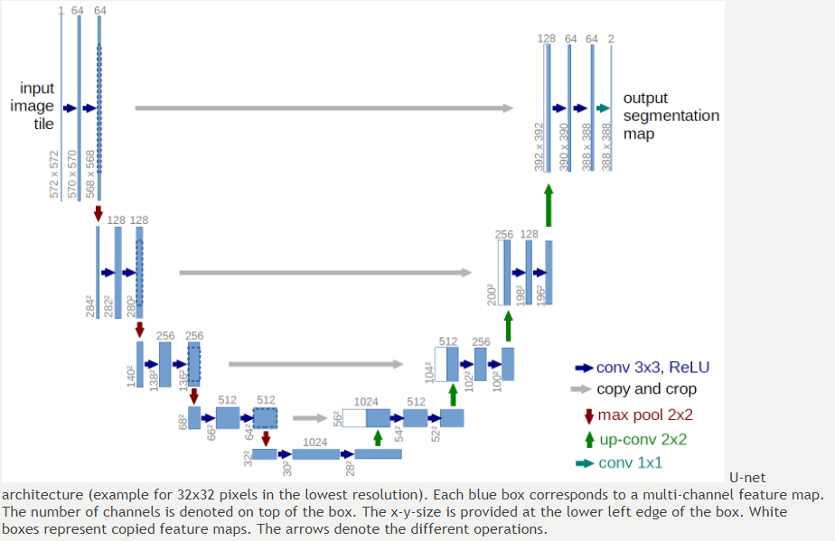
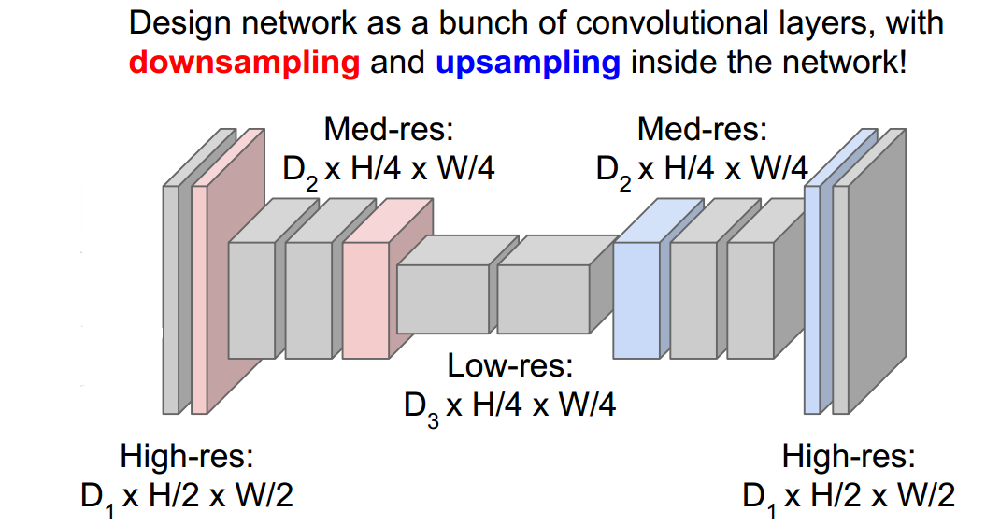

# Machine Learning Engineer Nanodegree
## Capstone Proposal
Nitish Puri   
August 28th, 2017

## Using Deep Learning for Image Masking

### Domain Background

One of the reason I decided to do the Machine Learning Nanodegree was my growing interest in computational perception. There are several closely related perception problems that are being addressed using the rapidly emerging field of deep learning. This project is one variant of the problem of [Image Segmenation](https://en.wikipedia.org/wiki/Image_segmentation) inspired from the [Kaggle Image Masking Challenge](https://www.kaggle.com/c/carvana-image-masking-challenge).   
Historically, the problem of image segmentation has been solved by using traditional Computer vision principles like k-means clustering, thresholding, edge detection and even lossy compression techniques. These techniques require careful engineering of the image pipeline, which can differ a lot between different problems or different datasets.The problem of image segmentation has been studied in various domains ranging from robot perception to medical image analysis and the results obtained and models created are transferable to these domains as well.

The challenge is organized by [Carvana](https://www.carvana.com/). An interesting part of their innovation is a custom rotating photo studio that automatically captures and processes 16 standard images of each vehicle in their inventory. While they capture high quality photos, bright reflections and cars with similar colors as the background cause automation errors, which requires a skilled photo editor to fix. In this project we are going to develop an algorithm that automatically removes the photo studio background. This will allow Carvana to superimpose cars on a variety of backgrounds. We will be analyzing a dataset of photos, covering different vehicles with a wide variety of year, make and model combinations.

### Problem Statement

As mentioned in the previous section, we are provided with 16 standard images(1918 X 1280) of each vehicle in their inventory. We also have a corresponding image mask(1918 X 1280) for each input image. The problem is in automatically create an image mask for unseen images of automobiles in a similar setting. One potential solution that I could immediately come think of was using Deep Neural Network that would label each pixel of the input image as belonging to background or automobile. The background pixels can then be masked to create an image mask for the given image.

### Datasets and Inputs

The dataset contains a large number of car images(as .jpg files) of different makes. Each car has exactly 16 images, each one taken at different angles. Each car has a unique id and images are named according to `id_01.jpg`, `id_01.jpg`, ...   `id_16.jpg`. In addition to the images, we also have some basic metadata about the car, the make, model, year and trim.
   
For training we are provided with with a .gif file that contains the manually cutout mask for each image.
This dataset can be obtained from the [Kaggle Challenge](https://www.kaggle.com/c/carvana-image-masking-challenge/data).  So, the main objective of the problem is to create an image mask, given an unseen image of an automobile. However, to simplify the submissions and evaluation, the final output is required to be converted into run-length encoding on the pixel values. Instead of an exhaustive list of indices for segmentation, we will generate pair of values that contain a start position and a run length. A sample output can be found [here](sample_submission.csv).

### Solution Statement

As I mentioned briefly before, we can use deep learning to create an output mask for a given image. Specifically we use a U-Net architecture for doing segmentation. U-Net models have been successfully applied in [medical image segmentation](https://lmb.informatik.uni-freiburg.de/people/ronneber/u-net/) problems without creating a very deep architecture. The reason we use deep learning is because traditional computer vision techniques might need to be engineered for various car poses or various models separately, and might not give satisfactory results. A deep learning model would be able to generalize better over the problem domain. 

### Benchmark Model

There are several traditional computer vision approaches that can be used to mask objects, however, these techniques would require you to engineer an image processing pipeline with carefully selected steps to generate a mask. We can instead use a coarser neural network model consisting of only fully connected convolution layers. The model would look something like this,   

This model would generate an image mask that can then be evaluated using the metric defined in the next section. 

### Evaluation Metrics

[Dice coefficient](https://en.wikipedia.org/wiki/S%C3%B8rensen%E2%80%93Dice_coefficient) can be used as an evaluation metric for the problem. It can be used to compare the pixel-wise agreement between a predicted segmentation and its corresponding ground truth. The formula is given by:   
   
where X is the predicted set of pixels and Y is the ground truth. The Dice coefficient is defined to be 1 when both X and Y are empty. The final score can be calculated as the mean of the Dice coefficients for each image in the test set.   

### Project Design

Image segmentation is a part of a broader range of problems involving object detection, localization and instance detection. All these problems can now be addressed by CNN models. I am going to create a simplified model that can achieve acceptable results by following these simple approaches:
* Use lower resolution imagery.
* Increase the amount of test data by augmentation.
* Generate more test data by using a rendering engine.

The aim here is to generate a lightweight model that can generate a background mask.   

I will be using Keras(with Tensorflow) for building and training the CNN. Keras seems to be a good choice because of the nice utils available both in Keras and Tensorflow for creating network graphs, visualizations, serialization and much more.     

Here is a high level workflow for the project:
* Initial data exploration: Discuss the input and output attributes like resolution, number of training examples etc..
* Data Pre/Post processing: Check what kind of pre/post processing we need and implement functions..
    * Change input resolution.
    * Input data normalization.
    * Use HSV instead of RGB color space.
    * Convert output mask to run-length encoding.
    * Randomize input data.
* Implement the benchmark and report its score.
* Build the first implementation of solution network and train with a random subset of samples for say 50 epochs.
* Tune Hyperparameters like `epochs`, `batch_size`, `dropout_probability`, etc.(whichever are available).
* Repeat the previous two steps until satisfactory learning model is achieved.
* Run the final model with the complete data (that maybe runs a little longer than the previously trained model).
* Test the model on available test set and report accuracy.
* Visualize test results.
* For free-form visualization : Play with tensorBoard and see the trends in hyperparameter tuning.

### References   

* [Carvana Image Masking Chalenge](https://www.kaggle.com/c/carvana-image-masking-challenge)
* [Convolution Networks for Visual Recognition](http://cs231n.github.io/)
* [U-Net: Convolutional Networks for Biomedical Image Segmentation](https://arxiv.org/abs/1505.04597)

