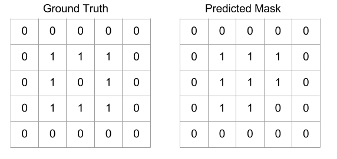

# Machine Learning Engineer Nanodegree
## Capstone Project
Nitish Puri  
August 31st, 2017

## Using Deep Learning for Image Masking

## I. Definition

### Project Overview

One of the reason I decided to do the Machine Learning Nanodegree was my growing interest in
computational perception. There are several closely related perception problems that are being 
addressed using the rapidly emerging field of deep learning. This project is one variant of the 
problem of [Image Segmenation](https://en.wikipedia.org/wiki/Image_segmentation) inspired from 
the [Kaggle Image Masking Challenge](https://www.kaggle.com/c/carvana-image-masking-challenge).   

Historically, the problem of image segmentation has been solved by using traditional Computer 
vision principles like k-means clustering, thresholding, edge detection and even lossy compression 
techniques. These techniques require careful engineering of the image pipeline, which can differ a lot 
between different problems or different datasets.The problem of image segmentation has been studied in 
various domains ranging from robot perception to medical image analysis and the results obtained and 
models created are transferable to these domains as well.

The challenge is organized by [Carvana](https://www.carvana.com/). An interesting part of their innovation is a custom rotating photo studio that automatically captures and processes 16 standard images of each vehicle in their inventory. While they capture high quality photos, bright reflections and cars with similar colors as the background cause automation errors, which requires a skilled photo editor to fix. In this project we are going to develop an algorithm that automatically removes the photo studio background. This will allow Carvana to superimpose cars on a variety of backgrounds. We will be analyzing a dataset of photos, covering different vehicles with a wide variety of year, make and model combinations.

### Problem Statement
As mentioned in the previous section, we are provided with 16 standard images(1918 X 1280) of each 
vehicle(318 vehicle categories for the training data) in their inventory. We also have a corresponding image mask(1918 X 1280) for each input 
image. The problem is in automatically create an image mask for unseen images of automobiles in a 
similar setting. One potential solution that I could immediately come think of was using Deep Neural 
Network that would label each pixel of the input image as belonging to background or automobile. The 
background pixels can then be masked to create an image mask for the given image.   
Specifically we will be using a U-net architecture that use Convolution layers to generate pixel level classification on the input image. These architectures are discussed in the following sections in more detail.

### Metrics

[Dice coefficient](https://en.wikipedia.org/wiki/S%C3%B8rensen%E2%80%93Dice_coefficient) can be used as an evaluation metric for the problem. Dice coefficient is a statistic used for comparing the similarity of two samples. Its range goes from *0* meaning no similarity to *1* meaning maximum similarity. It can be used to compare the pixel-wise agreement between a predicted segmentation and its corresponding ground truth. The formula is given by:   
   
where X is the predicted set of pixels and Y is the ground truth. The Dice coefficient is defined to be 1 when both X and Y are empty. For example consider these two example 5X5 image masks.   
   

Here,   
X = 8,   
Y = 8,   
X & Y = 6   

So, 
QS = (2 * 6)/(8 + 8)   
QS = 0.75    

The final score can be calculated as the mean of the Dice coefficients for each image in the test set.   

## II. Analysis
_(approx. 2-4 pages)_

### Data Exploration

Here are some of the questions that i wanted to answer while progressing through this project.

* Can I train a model to predict the manufacturer?
* Background is always the same. how can i take advantage of that? 
* How do we/network deal with the reflections?

Since this is a Kaggle competition, we already have separate test and train data available.   
Training data is in the form of (1280 X 1918) RGB images. Each image has an associated metadata, 
| id           	| year   	| make      	| model  	| trim1  	| trim2                   	|
|--------------	|--------	|-----------	|--------	|--------	|-------------------------	|
| 0004d4463b50 	| 2014.0 	| Acura     	| TL     	| TL     	| w/SE                    	|
| 00087a6bd4dc 	| 2014.0 	| Acura     	| RLX    	| RLX    	| w/Tech                  	|
| 000aa097d423 	| 2012.0 	| Mazda     	| MAZDA6 	| MAZDA6 	| i Sport                 	|
| 000f19f6e7d4 	| 2016.0 	| Chevrolet 	| Camaro 	| Camaro 	| SS                      	|
| 00144e887ae9 	| 2015.0 	| Acura     	| TLX    	| TLX    	| SH-AWD V6 w/Advance Pkg 	|

In this section, you will be expected to analyze the data you are using for the problem. This data can either be in the form of a dataset (or datasets), input data (or input files), or even an environment. The type of data should be thoroughly described and, if possible, have basic statistics and information presented (such as discussion of input features or defining characteristics about the input or environment). Any abnormalities or interesting qualities about the data that may need to be addressed have been identified (such as features that need to be transformed or the possibility of outliers). Questions to ask yourself when writing this section:
- _If a dataset is present for this problem, have you thoroughly discussed certain features about the dataset? Has a data sample been provided to the reader?_
- _If a dataset is present for this problem, are statistics about the dataset calculated and reported? Have any relevant results from this calculation been discussed?_
- _If a dataset is **not** present for this problem, has discussion been made about the input space or input data for your problem?_
- _Are there any abnormalities or characteristics about the input space or dataset that need to be addressed? (categorical variables, missing values, outliers, etc.)_

### Exploratory Visualization
In this section, you will need to provide some form of visualization that summarizes or extracts a relevant characteristic or feature about the data. The visualization should adequately support the data being used. Discuss why this visualization was chosen and how it is relevant. Questions to ask yourself when writing this section:
- _Have you visualized a relevant characteristic or feature about the dataset or input data?_
- _Is the visualization thoroughly analyzed and discussed?_
- _If a plot is provided, are the axes, title, and datum clearly defined?_

### Algorithms and Techniques
In this section, you will need to discuss the algorithms and techniques you intend to use for solving the problem. You should justify the use of each one based on the characteristics of the problem and the problem domain. Questions to ask yourself when writing this section:
- _Are the algorithms you will use, including any default variables/parameters in the project clearly defined?_
- _Are the techniques to be used thoroughly discussed and justified?_
- _Is it made clear how the input data or datasets will be handled by the algorithms and techniques chosen?_

### Benchmark
In this section, you will need to provide a clearly defined benchmark result or threshold for comparing across performances obtained by your solution. The reasoning behind the benchmark (in the case where it is not an established result) should be discussed. Questions to ask yourself when writing this section:
- _Has some result or value been provided that acts as a benchmark for measuring performance?_
- _Is it clear how this result or value was obtained (whether by data or by hypothesis)?_

## III. Methodology
_(approx. 3-5 pages)_

### Data Preprocessing
In this section, all of your preprocessing steps will need to be clearly documented, if any were necessary. From the previous section, any of the abnormalities or characteristics that you identified about the dataset will be addressed and corrected here. Questions to ask yourself when writing this section:
- _If the algorithms chosen require preprocessing steps like feature selection or feature transformations, have they been properly documented?_
- _Based on the **Data Exploration** section, if there were abnormalities or characteristics that needed to be addressed, have they been properly corrected?_
- _If no preprocessing is needed, has it been made clear why?_

### Implementation
In this section, the process for which metrics, algorithms, and techniques that you implemented for the given data will need to be clearly documented. It should be abundantly clear how the implementation was carried out, and discussion should be made regarding any complications that occurred during this process. Questions to ask yourself when writing this section:
- _Is it made clear how the algorithms and techniques were implemented with the given datasets or input data?_
- _Were there any complications with the original metrics or techniques that required changing prior to acquiring a solution?_
- _Was there any part of the coding process (e.g., writing complicated functions) that should be documented?_

### Refinement
In this section, you will need to discuss the process of improvement you made upon the algorithms and techniques you used in your implementation. For example, adjusting parameters for certain models to acquire improved solutions would fall under the refinement category. Your initial and final solutions should be reported, as well as any significant intermediate results as necessary. Questions to ask yourself when writing this section:
- _Has an initial solution been found and clearly reported?_
- _Is the process of improvement clearly documented, such as what techniques were used?_
- _Are intermediate and final solutions clearly reported as the process is improved?_

## IV. Results
_(approx. 2-3 pages)_

### Model Evaluation and Validation
In this section, the final model and any supporting qualities should be evaluated in detail. It should be clear how the final model was derived and why this model was chosen. In addition, some type of analysis should be used to validate the robustness of this model and its solution, such as manipulating the input data or environment to see how the model’s solution is affected (this is called sensitivity analysis). Questions to ask yourself when writing this section:
- _Is the final model reasonable and aligning with solution expectations? Are the final parameters of the model appropriate?_
- _Has the final model been tested with various inputs to evaluate whether the model generalizes well to unseen data?_
- _Is the model robust enough for the problem? Do small perturbations (changes) in training data or the input space greatly affect the results?_
- _Can results found from the model be trusted?_

### Justification
In this section, your model’s final solution and its results should be compared to the benchmark you established earlier in the project using some type of statistical analysis. You should also justify whether these results and the solution are significant enough to have solved the problem posed in the project. Questions to ask yourself when writing this section:
- _Are the final results found stronger than the benchmark result reported earlier?_
- _Have you thoroughly analyzed and discussed the final solution?_
- _Is the final solution significant enough to have solved the problem?_

## V. Conclusion
_(approx. 1-2 pages)_

### Free-Form Visualization
In this section, you will need to provide some form of visualization that emphasizes an important quality about the project. It is much more free-form, but should reasonably support a significant result or characteristic about the problem that you want to discuss. Questions to ask yourself when writing this section:
- _Have you visualized a relevant or important quality about the problem, dataset, input data, or results?_
- _Is the visualization thoroughly analyzed and discussed?_
- _If a plot is provided, are the axes, title, and datum clearly defined?_

### Reflection
In this section, you will summarize the entire end-to-end problem solution and discuss one or two particular aspects of the project you found interesting or difficult. You are expected to reflect on the project as a whole to show that you have a firm understanding of the entire process employed in your work. Questions to ask yourself when writing this section:
- _Have you thoroughly summarized the entire process you used for this project?_
- _Were there any interesting aspects of the project?_
- _Were there any difficult aspects of the project?_
- _Does the final model and solution fit your expectations for the problem, and should it be used in a general setting to solve these types of problems?_

### Improvement
In this section, you will need to provide discussion as to how one aspect of the implementation you designed could be improved. As an example, consider ways your implementation can be made more general, and what would need to be modified. You do not need to make this improvement, but the potential solutions resulting from these changes are considered and compared/contrasted to your current solution. Questions to ask yourself when writing this section:
- _Are there further improvements that could be made on the algorithms or techniques you used in this project?_
- _Were there algorithms or techniques you researched that you did not know how to implement, but would consider using if you knew how?_
- _If you used your final solution as the new benchmark, do you think an even better solution exists?_

-----------

**Before submitting, ask yourself. . .**

- Does the project report you’ve written follow a well-organized structure similar to that of the project template?
- Is each section (particularly **Analysis** and **Methodology**) written in a clear, concise and specific fashion? Are there any ambiguous terms or phrases that need clarification?
- Would the intended audience of your project be able to understand your analysis, methods, and results?
- Have you properly proof-read your project report to assure there are minimal grammatical and spelling mistakes?
- Are all the resources used for this project correctly cited and referenced?
- Is the code that implements your solution easily readable and properly commented?
- Does the code execute without error and produce results similar to those reported?
